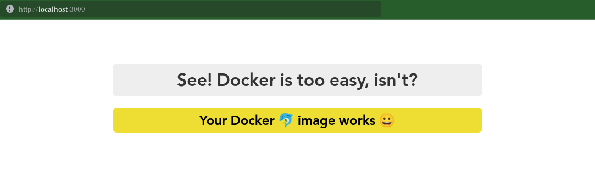

# Dockerized Node Application
Simple node application inside of docker image.

## How to use this image
_Make sure that **docker** is up and running_

### Making the image available for running it.
There are two ways to do so.

#### 1. From Dockerhub
- Pull the image and Run the container.
```shell
docker container run --detach --publish 3000:3000 abdeltwabmf/dockerized-node
```
Now you are good to go!

#### 2. From Dockerfile
- Clone this repository.
```shell
git clone https://github.com/AbdeltwabMF/dockerized-node.git
```
- Build the image.
```shell
docker build --tag dockerized-node .
```
- Running the container.
```shell
docker container run --detach --publish 3000:3000 dockerized-node
```

### Open your favorite browser and navigate to: ```http://localhost:3000```

<br/>

Now You should see something like this 😄.


